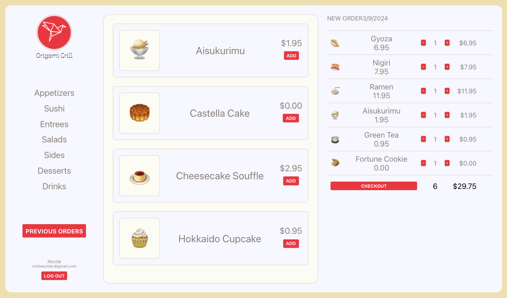

# Origami Grill

This repository contains the code for a full-stack MERN project that is conditionally rendered based on the user state. 
* Server-side ----> PORT:8000
* Client-side ----> PORT:3000

Live Project Link: [https://origamigrill.nicolebeechler.me](origamigrill.nicolebeechler.me)

## About: 

A simple e-commerce website.

* A user can log in or sign up.
* After logging in, a user can order items from the menu or view previous orders. 



## API Endpoints:
Items: 
1. <span style="color:green">**GET**</span> /api/items 
2. <span style="color:green">**GET**</span> /api/items/:id 

Orders: 
1. <span style="color:green">**GET**</span> /cart
2. <span style="color:green">**GET**</span> /api/orders/history
3. <span style="color:yellow">**POST**</span> /api/orders/cart/items/:id

Users: 
1. <span style="color:yellow">**POST**</span> /api/users
2. <span style="color:yellow">**POST**</span> /api/users/login
3. <span style="color:green">**GET**</span> /api/users/check-token (middleware: `ensureLoggedIn`)

## Downloading/Cloning: 

Set up your environment: 

1. Clone this repository.
```console
$ git@github.com:nicolebeechler/mern-project.git
```
2. Install Gulp and Nodemon globally 
```console
$ npm i -g gulp-cli
$ npm i -g nodemon
```
3. Include your SHA256 SECRET hash and MONGO_URI in your `.env` file at the root level
4. Install the dependencies
```console
$ npm i
```
5. Upload the `seed.js` data file to your database
```console
$ node config/seed.js
```

## Technologies Used: 
- MongoDB/Mongoose
- Express
- React
- Node
- Bcrypt - Password Hashing
- JSON Web Token - Authentication
- [big-poppa-code-react-starter-kit](https://www.npmjs.com/package/big-poppa-code-react-starter-kit?activeTab=readme)

## Deployment:
- DigitalOcean - Cloud Server
- Nginx - Web Server with SSL Certificate
- PM2 - Process manager for Node.js
- NameCheap - Domain